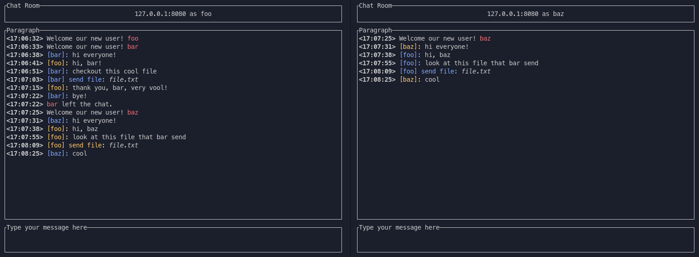

# Aсинхронный TCP чат

Написан на Rust.
Работа проверялась на ArchLinux дистрибутиве.

## Протокол

### Логин

Подразумевает последовательность действий:

1. Отправка дескриптора сообщения с типом Login (1).
2. Отправка заголовка сообщения (имя пользователя, UTF-8 строка).
3. Ожидание ответа от сервера (дескриптор). Возможные ответы:
    - UsernameExists = 3
    - BadUsername = 4
    - BadLogin = 5

### Сообщение

Подразумевает последовательность действий:

1. Отправка дескриптора сообщения. Разрешенные типы сообщения:
    - File = 8
    - Utf8 = 7
    - Image = 6
    - Voice = 9
2. Отправка заголовка сообщения (если есть).
3. Отправка содержимого.

Формат дескриптора:

```text
 0               1               2               3
 0 1 2 3 4 5 6 7 0 1 2 3 4 5 6 7 0 1 2 3 4 5 6 7 0 1 2 3 4 5 6 7 
+-+-+-+-+-+-+-+-+-+-+-+-+-+-+-+-+-+-+-+-+-+-+-+-+-+-+-+-+-+-+-+-+
|          Message Type          |         Header Size          |
+-+-+-+-+-+-+-+-+-+-+-+-+-+-+-+-+-+-+-+-+-+-+-+-+-+-+-+-+-+-+-+-+
|                           Reserved                            |
+-+-+-+-+-+-+-+-+-+-+-+-+-+-+-+-+-+-+-+-+-+-+-+-+-+-+-+-+-+-+-+-+
|                       Conten size (Hi)                        |
+-+-+-+-+-+-+-+-+-+-+-+-+-+-+-+-+-+-+-+-+-+-+-+-+-+-+-+-+-+-+-+-+
|                       Conten size (Lo)                        |
+-+-+-+-+-+-+-+-+-+-+-+-+-+-+-+-+-+-+-+-+-+-+-+-+-+-+-+-+-+-+-+-+
```

Заголовок клиента - имя пользователя при отправке `Login` сообщения, имя файла при отправке `File` сообщения.

```Rust
struct Header {
    pub to: Option<String>,       // username if message is private
    pub filename: Option<String>, // filename if sending a file
}
```

Заголовок сервера - сериализованная в формате JSON структура:

```Rust
struct Header {
    pub from: String,    // sender of the message
    pub timestamp: DateTime<Utc>, // message timestamp
    pub filename: Option<String>,   // name of the file
}
```

Чтобы войти в комнату, клиент должен отправить дескриптор с Message type = Login и заголовок с to = "username", после чего дождаться ответа от сервера.

## Как это выглядит



## Запуск

Сервер:

```sh
cargo run --bin server -- --address=<address>
# Default value for address is 127.0.0.1:8080
```

Клиент:

```sh
cd client
cargo run --bin client -- --address=<address> --username=<username> --save_directory==<save_directory>
# Default value for address is 127.0.0.1:8080
# Default value for save_directory is .
```
